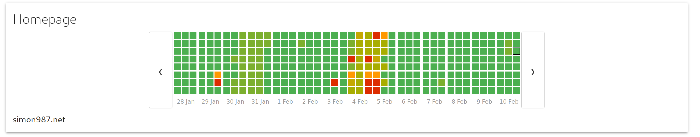

# status

Minimalist status page



Built with:
* Akka
* H2 Database
* Slick
* cal-heatmap
* scalatra


## Configuration

`config.yml`
```yaml
sites:
  - url: "https://example.net/"
    description: description
    summary: summary (HTML enabled)
  - url: "https://example2.net/"
    description: another descripion
    summary: summary 2
```

## Usage
### (docker-compose)
```yaml
services:
  status:
    image: simon987/status:latest
    container_name: status
    ports:
      - <PORT>:8080
    restart: always
    volumes:
      - type: volume
        source: status
        target: /app
```

### (Docker)
```
docker run -v $(pwd)/config.yml:/app/config.yml -p <PORT>:8080 simon987/status
```

### (JVM)

```
sbt assembly
java -jar target/scala-2.13/status-assembly-0.1.jar
```
